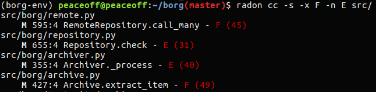

# Verificação e Validação
## Grau de testabilidade

  Durante a fase de desenvolvimento é de extrema importância a inclusão de testes de modo a certificar o funcionamento do programa. No que diz respeito à verificação e validação, BorgBackup realiza vários testes para garantir um bom funcionamento e a satisfação de todos os requisitos.

### Controlabilidade:
    
  A nível de controlabilidade dos componentes, BorgBackup utiliza um conjunto de ferramentas para a construção de métricas de avaliação, estas ferramentas estão disponíveis sob forma de módulos (ex: pytest) que mais tarde são utilizados para a geração de métricas de cobertura e realização de testes. A execução de casos de teste é relativamente simples, com a utilização da ferramenta Tox/Tarvis-CI, que tem como principal objetivo automatizar e “standardizar” testes em Python, sendo assim possível obter estatísticas sobre a aprovação dos testes e a sua respetiva cobertura. Estes testes podem ser realizados utilizando apenas o seguinte comando: “fakeroot -u tox”. Alguns testes são específicos a certas plataformas, sendo que não são executados caso não sejam compatíveis com o sistema utilizado para os testes.

### Observabilidade:

  Em termos de observabilidade, o uso da ferramenta Tox/Travis-CI facilita bastante a visualização de testes, mostrando, de uma forma simples e intuitiva os testes que foram bem sucedidos, as falhas encontradas durante a execução da bateria de testes e ainda a cobertura obtida nos diversos ficheiros testados sendo que a cobertura pode ser interpretada através de uma interface mais amigável [aqui](https://codecov.io/gh/borgbackup/borg/tree/734f8a9417ac3556ca7e595733c98e7267d9703e/src/borg) . Já no Travis-CI existem páginas dedicadas a cada build do projeto com os respectivos [“logs”](https://travis-ci.org/borgbackup/borg/jobs/179852544)  gerados pelo [Tox](https://tox.readthedocs.io/en/latest/),tornando assim mais simples a interpretação do estado de execução dos testes.

### Isolabilidade:

  A isolabilidade é uma questão de grande importância durante a fase de testes porque, para um determinado problema encontrado, o grau de isolamento determina diretamente o tempo de detecção e correção do erro. Visto que o isolamento é diretamente influenciado pela controlabilidade, para o aumento do grau do isolamento será necessário uma boa pilha de testes que permita localizar e especificar o problema. Seguindo o ponto de vista da equipa por detrás de Borgbackup, os testes são realizados de modo a que a test suite cubra a maioria (idealmente todas) as árvores de código numa tentativa de isolamento de bugs. 

### Separação de responsabilidades:

  O borg encontra-se separado em vários módulos gerais que depois se dividem em pequenos módulos/ficheiros que asseguram assim uma maior facilidade na interpretação de todas as funcionalidades, permitindo distinguir as responsabilidades referentes à integração nos diferentes sistemas operativos, testes e lógica, assim como facilitar o desenvolvimento de testes.
  
No entanto ainda existem alguns aspetos a melhorar como referido no relatório [transacto](https://github.com/JoseLuisMartins/borg/blob/master/ESOF-docs/3.Software%20Architecture.md#introduction), nomeadamente a estruturação da lógica do projeto.

### Compreensibilidade:
  O projeto possui uma documentação relativamente boa para novos utilizadores que planeiam começar a utilizar o borg, existindo descrições detalhadas dos comandos existentes e do funcionamento básico do borg. No entanto é também importante que o código fonte seja claro e bem documentado para facilitar a compreensão de contribuidores externos, neste aspeto verificamos algumas debilidades, sendo por vezes necessária uma inspeção profunda do código para compreender alguns detalhes.
O fator atenuante é a comunidade Borg que se mostra muito aberta a novos contribuidores, existindo sempre alguém no IRC do projeto para esclarecer possíveis detalhes técnicos que a documentação não esteja a referir.

### Heterogeneidade:
        
O Borg utiliza várias tecnologias externas apresentando portanto um certo grau de heterogeneidade, as principais bibliotecas utilizadas são:

* [pytest](http://doc.pytest.org/en/latest/) - Utilizada para a realização de testes
* [argparse](https://docs.python.org/3/library/argparse.html)
  Útil para a realização de interfaces amigáveis pela linha de comandos. 
* [zlib](http://www.zlib.net/),[lzma](https://docs.python.org/3/library/lzma.html),[lz4](https://github.com/lz4/lz4)
  Diferentes tipos de compressão que são disponibilizados ao utilizador, cada um com as suas vantagens e desvantagens.
* AES - encriptação 

O uso destas bibliotecas facilita bastante o desenvolvimento do projeto, permitindo um nível de abstração muito mais elevado. Estas bibliotecas não afetam os testes uma vez que provêm todas de fontes seguras e fiáveis tendo já sido exaustivamente testadas.

##Estatísticas de teste

Atualmente o Borg possui 851 testes unitários divididos em diferentes classes, que testam componentes específicos do software sendo que destes testes:

* 694 passaram com sucesso (passed);
* 155 não foram testados visto que dizem respeito ao sistema operativo em que o utilizador se encontra (skipped);
* 2 passaram no entanto era esperado que falhassem (xpassed).
Estes testes foram executados pelo grupo tendo sido obtidos os mesmos resultados que os reportados no [travis-ci](https://travis-ci.org/borgbackup/borg), foram ainda obtidas outras métricas:

Métricas obtidas com a ferramenta [codecov](https://codecov.io/gh/borgbackup/borg/tree/e9d7f928e2061bc5f26e7a67aa6d26a37c4ec4b5/src/borg):
	
 * Percentagem de cobertura geral do projeto: 82.72 %.

Métricas obtidas com a ferramenta [radon](https://pypi.python.org/pypi/radon):

* Complexidade Ciclomática média do projeto  : 3.308(por método).

Regra geral, Borgbackup apresenta uma complexidade ciclomática baixa.
Sendo os seguintes métodos os mais complexos do projeto:

1. Archive.extract_item (archive.py) - 49 
2. RemoteRepository.call_many (remote.py) - 45
3. Archiver._process (archiver.py) - 40
4. repository.check (repository.py) - 31 

Foi usado o comando “radon cc -s -x F -n E src/” que mostra a complexidade ciclomática (‘cc’) com valor máximo ‘-x F’ e valor mínimo ‘-n E’ mostrando ainda o valor exato com o parâmetro ‘-s’.

Métricas obtidas com a ferramenta [codacy](https://www.codacy.com/app/Jose-MartinsOrganization/borg/dashboard):
	
  * Propenso a erros : 8% 	
  * Estilo código: 58%
  * Segurança : 100%

## Identificação e correção do bug

O bug resolvido pelo grupo diz respeito á issue [#1914](https://github.com/borgbackup/borg/issues/1914) seguindo-se uma breve descrição do problema encontrado e da sua resolução.

### Problema:

O problema com que o grupo se deparou relaciona-se com o execução do comando ``borg info`` quando a variável de ambiente  ``BORG_REPO`` está definida com o _path_ do repositório a ser utilizado de momento.
O comportamento esperado para a execução deste comando sem qualquer parâmetro seria a listagem da informação de todos os arquivos contidos no repositório definido em ``BORG_REPO``, no entanto esta execução apenas mostrava a _help_ do comando sendo necessário especificar um arquivo para poder executar o comando (ex: ``borg indo ::archive``), desta forma apenas era possível avaliar a informação de um arquivo individualmente, sendo que também deveria ser possível avaliar a informação de todos os arquivos do repositório quando o arquivo não é especificado nos parâmetros do comando.

### Resolução:

A resolução do problema passou pela adição da especificação do número de argumentos e do valor _default_ do argumento, conteúdo que estava em falta no _parser_ do comando ``borg info`` ([archiver.py](https://github.com/borgbackup/borg/blob/master/src/borg/archiver.py)) e impedia a interpretação pretendida do comando quando este não possuía qualquer argumento.
Foi criado um [_pull request_](https://github.com/borgbackup/borg/pull/1917), pelo grupo para a resolução do problema tendo este sido aceite e _merged_ com sucesso para _master branch_ do repositório [Borg Backup](https://github.com/borgbackup/borg).

## Contribuições

* [David Azevedo](https://github.com/PeaceOff) : ⅓ * 100%
* [João Ferreira](https://github.com/joaocsf) : ⅓ * 100%
* [José Martins](https://github.com/JoseLuisMartins) : ⅓ * 100%
