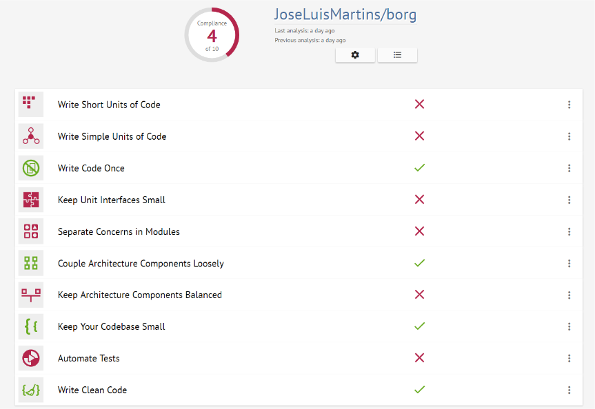
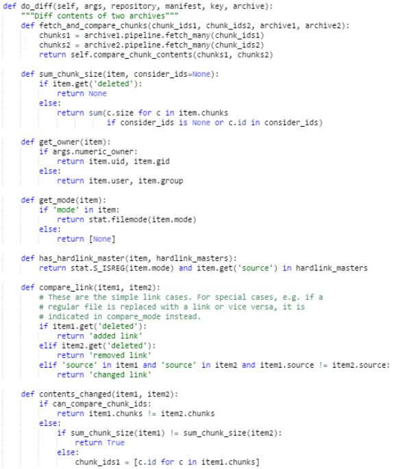
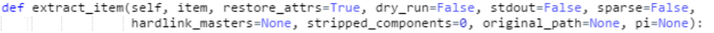
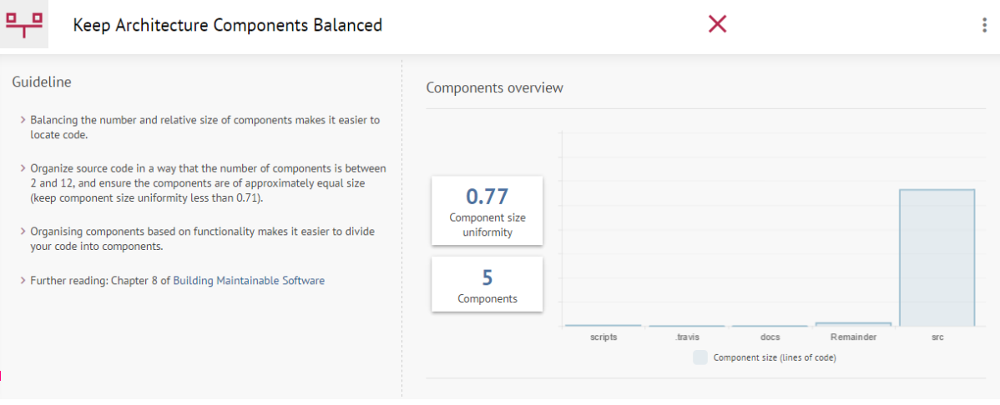
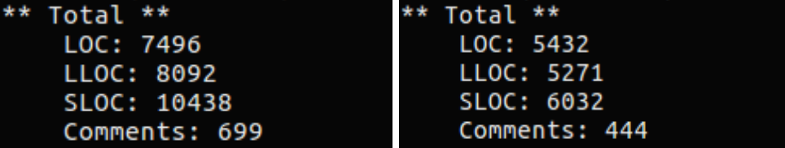
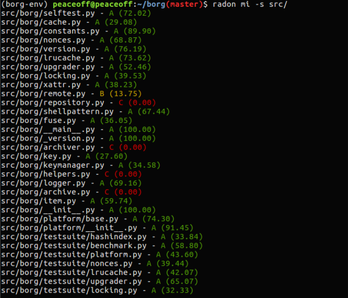

#Software Maintainability
De forma a testar da melhor maneira possível os índices de manutenção do software em questão foram utilizadas duas ferramentas, [better code hub](https://bettercodehub.com/results/JoseLuisMartins/borg ) e [radon](https://pypi.python.org/pypi/radon), nos tópicos seguintes é feita uma análise às métricas obtidas pelas duas. 

##Better Code Hub
O BorgBackup obteve uma classificação total de 4 em 10 nas métricas computadas pela ferramenta Better Code Hub, segue-se agora uma descrição e interpretação de cada métrica.

###Write Short Units of Code
Este métrica falhou uma vez que existem alguns métodos bastante extensos, em particular o Archiver.build_parser(self,prog) com 698 linhas de código, devido ao facto do método conter todo o parsing dos comandos do programa, incluindo para cada comando a sua respetiva documentação(razoavelmente extensa em alguns casos), deste modo o resultado torna-se enganador para o método em questão, porém existem vários outros métodos que poderiam ser revistos de modo a minimizar o seu tamanho(normalmente os restantes métodos têm todos á volta de 100 linhas).

###Write Simple Units of Code
Alguns métodos do projeto são pouco lineares apresentando uma complexidade Ciclomática/de McCabe elevada o que causa a falha neste teste.
No entanto esta métrica não se encontra 100% correta uma vez que a maior parte dos métodos com complexidade ciclomática elevada possuem várias nested functions que não são tidas em consideração pelo better code hub individualmente, como é possível observar na imagem exemplo.

###Write  Code Once
Este é um dos aspetos positivos do Borg, o código encontra-se bem dividido e modularizado, evitando assim a sua repetição. 

###Keep Unit Interfaces Small
Esta métrica falhou, no entanto os métodos com um número elevado de parâmetros apresentam usualmente valores default para a grande maioria, sendo por isso chamados com um valor mais reduzido de parâmetros pelo que embora algumas interfaces pudessem eventualmente ser mais reduzidas, no contexto do projeto existem situações em que este tipo de interface acaba por ser o mais adequado.

###Separate Concerns in Modules
Falhou, devido ao facto de alguns componentes não estarem completamente abstraídos, o melhor exemplo é o helpers.py que possui um conjunto de utilidades muito variadas em termos de utilização, pelo que é incluida em vários módulos. Sendo necessária uma  melhor separação de conceitos por parte do borg.

###Couple Architecture Components Loosely
Esta métrica foi bem sucedida, visto que os componentes podem ser desenvolvidos isoladamente sem ser necessária a intervenção a módulos diferentes, a não ser o que está a ser desenvolvido.

###Keep Architecture Components Balanced
Na medição desta métrica verificou-se uma limitação no better code hub uma vez que este não foi capaz de detectar os diferentes componentes incluídos na pasta source, assumindo ao invés disso as pastas externas como componentes, desta forma os resultados obtidos não podem ser tomados como verídicos.

###Keep Your Codebase Small
Manter o código conciso é importante na medida em que no futuro o tempo necessário para compreender o código seja mais baixo por forma a facilitar a sua manutenção. A métrica de man-year representa o trabalho médio realizado por um indivíduo num ano de trabalho, o borg obteve um resultado de 29 man-months.

###Automate tests
Esta medição sugeriu um resultado inesperado, isto porque não foi capaz de detectar o testsuit utilizado pelo borg para validar o software. Assim sendo não poderá ser tida em conta o cálculo desta métrica.

###Write Clean Code
O resultado desta métrica relaciona-se com o uso do ‘flake8’, responsável por orientar e verificar a consistência do código fonte, mantendo a estrutura de código limpa e concisa.

##Radon
 
O grupo utilizou ainda a ferramenta Radon, já referida no relatório anterior, para medir o índice de _Maintainability_ do projeto. Existe uma certa dificuldade em comparar os resultados obtidos com os do _bettercodehub_ uma vez que esta ferramenta possui limitações na interpretação das componentes do projeto como referido no ponto _Keep Architecture Components Balanced_.

Foram ainda obtidas algumas métricas gerais do projecto utilizando o comando `radon raw`. A imagem da esquerda diz respeito ao source code do projeto e a imagem da direita é referente aos testes do _borg_, estas métricas foram obtidas por forma a demonstrar um _overview_ geral da extensibilidade do código.

Legenda:
* __LOC__: número total de linhas de código;
* __LLOC__: número de linhas lógicas de código;
* __SLOC__: número de linhas de código fonte;
* __Comments__: número total de comentários.

Na imagem que se segue encontram-se os resultados do comando `radon mi -s src/` no qual `mi` representa _Maintainability Index_, `-s` para mostrar o score e `src/` é o directório onde o comando irá ser executado. Os resultados são mostrados numa escala de 0 a 100.

Como é possível observar na imagem, em geral, o projeto apresenta um índice de manutenção bom (verde). Na realidade, estes resultados são, de alguma forma, enganadores uma vez que, apesar de vários módulos obterem um bom índice de manutenção, aqueles que apresentam um valor mais baixo, são os módulos mais importantes do projeto e consequentemente os mais extensos.

#Evolution Process

##Como foi encontrada a feature?

Existem várias formas de identificar novas funcionalidades (ainda à procura de implementação) para  o __BorgBackup__, como as seguintes:
* Exploração das _Issues_ do projeto;
* Diálogo com os membros da comunidade __Borg__(por exemplo através do [IRC](http://webchat.freenode.net/?randomnick=1&channels=%23borgbackup&uio=MTY9dHJ1ZSY5PXRydWUa8))
* Através do uso do programa.

No entanto, a forma mais simples, a nosso ver, é ,sem dúvida alguma, através da exploração de todas as _issues_ atribuídas ao projeto, tendo sido esta a alternativa seguida para encontrar uma funcionalidade que se adequasse ao nosso conhecimento do projeto e as nossas capacidades atuais.

##O porquê desta feature?
A [issue](https://github.com/borgbackup/borg/issues/1812) que despertou o nosso interesse, é relativa à exportação de estatísticas, de uma forma que seja facilmente interpretada por outros softwares e, que permita assim, a criação de gráficos com informações relativas aos backup’s realizados anteriormente e ao estado dos repositórios/arquivos.
Esta funcionalidade foi escolhida, uma vez que, parecia exequível na quantidade de tempo que dispúnhamos, sendo ao mesmo tempo uma funcionalidade interessante que pode vir a ter muita utilidade num futuro próximo, uma vez que o Borg possui o desenvolvimento de um projeto em paralelo, o [BorgWeb](https://github.com/borgbackup/borgweb), que tem em vista, fornecer uma interface amigável para o utilizador, permitindo a realização de Backup’s através do um serviço web. 
Sendo que ficheiros de estatísticas exportados em formatos como json podem ser bastante úteis na construção de gráficos user-friendly, que podem ser colocados no site, permitindo aos utilizadores terem acesso à informação dos seus Backups, de uma forma bastante mais intuitiva, em relação à forma utilizada agora(log files por vezes não organizados da forma mais perceptível).

##Implementação da feature
A abordagem seguida pelo grupo para a integração desta funcionalidade, passou pela implementação de uma flag `--export-file`, no comando `borg info`, que quando especificada, exporta para o caminho definido, um ficheiro(json) com toda a informação relativa ao arquivo (quando o comando é executado com um arquivo) ou relativa ao repositório no seu todo (quando o comando é especificado apenas com o repositório).
Devido às análises de código que o grupo fez, tendo em vista os relatórios transatos, a identificação de ficheiros e zonas a alterar, foi razoavelmente simples uma vez que o workflow básico da aplicação já é conhecido pelo grupo.
Assim numa primeira fase foi adicionado ao ficheiro [archiver.py](https://github.com/borgbackup/borg/blob/master/src/borg/archiver.py ) ,especificamente ao subparser do comando `borg info`,  o parse da flag  `--export-file`,
tendo depois sido alterado o método `do_info`(chamado depois do parse do comando `borg info` com os respetivos argumentos inseridos pelo utilizador),  de modo a exportar os dados num ficheiro json quando a flag é especificada.
Foram também acrescentados métodos `get_summary` no [archive.py](https://github.com/borgbackup/borg/blob/master/src/borg/archive.py) e [cache.py](https://github.com/borgbackup/borg/blob/master/src/borg/cache.py ), para permitir o acesso à informação de cada um destes módulos, numa forma organizada (dicionário).
Por fim, foi criado um ficheiro exporter.py, com o método responsável pela exportação dos dados em json, este ficheiro foi criado de modo a permitir uma separação de conceitos, e facilitar a adição no futuro de mais formatos de exportação, assim como outros métodos relacionados.  

#Pull request
Depois da realização de todas as alterações que achamos pertinentes e de correr todos os testes do projeto, de forma a verificar que não estaríamos a introduzir problemas ao software principal, foi efetuado um [pull request](https://github.com/borgbackup/borg/pull/1946 ) para o [master branch](https://github.com/borgbackup/borg/tree/master ) do borg.

## Contribuições

* [David Azevedo](https://github.com/PeaceOff) : ⅓ * 100%
* [João Ferreira](https://github.com/joaocsf) : ⅓ * 100%
* [José Martins](https://github.com/JoseLuisMartins) : ⅓ * 100%
